# Eatlify — Food Ordering, Microservices

A Swiggy/Zomato-style food ordering and delivery platform built as six
independent Node.js services behind a React SPA. Customers discover nearby
restaurants, order, pay, and watch the rider approach on a live map; sellers run
their menu and see their sales; riders take deliveries and track earnings; an
admin approves new restaurants and riders.

## Screenshots

### Customer

| Discover nearby restaurants | Restaurant menu |
|---|---|
| 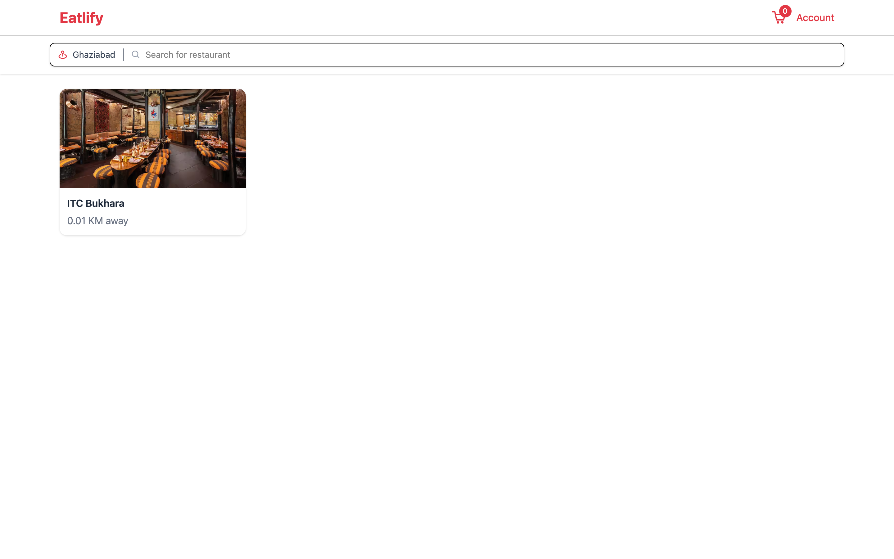 | 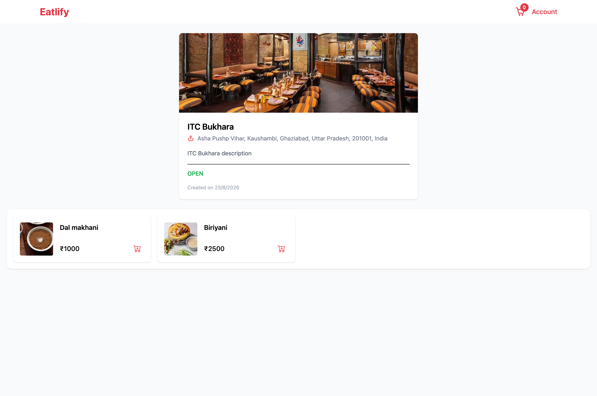 |

| Checkout | Live order tracking |
|---|---|
| 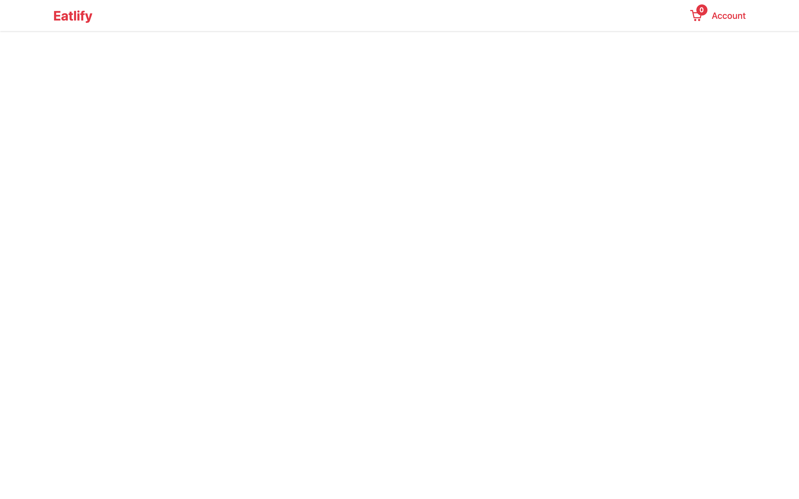 | 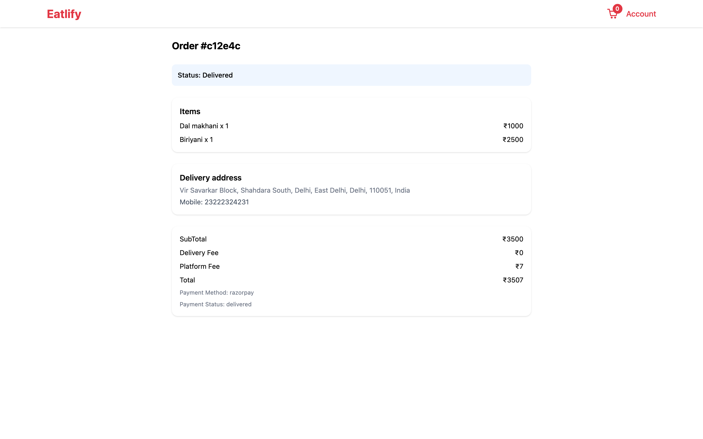 |

| Order history | Account |
|---|---|
| 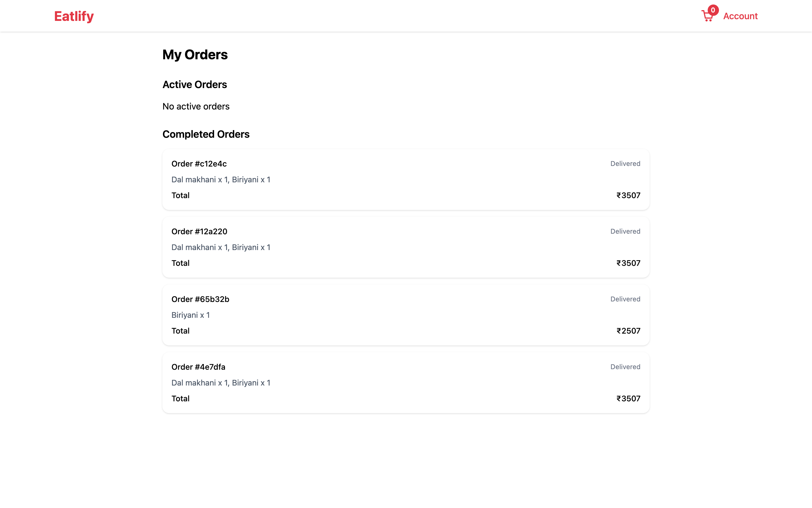 | 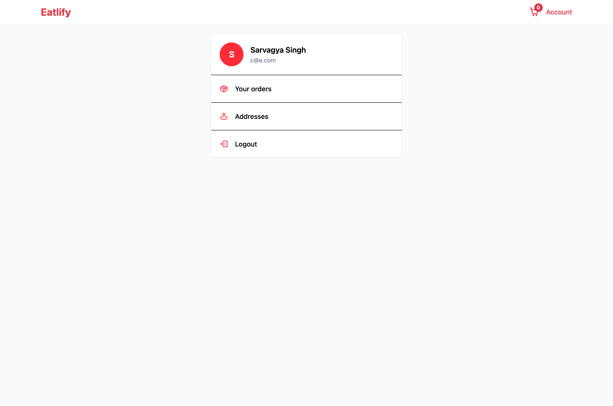 |

### Restaurant owner

Live order board, menu management, and the sales dashboard — gross food sales,
platform commission, net payout, a daily series and best sellers.

| Dashboard | Sales |
|---|---|
| 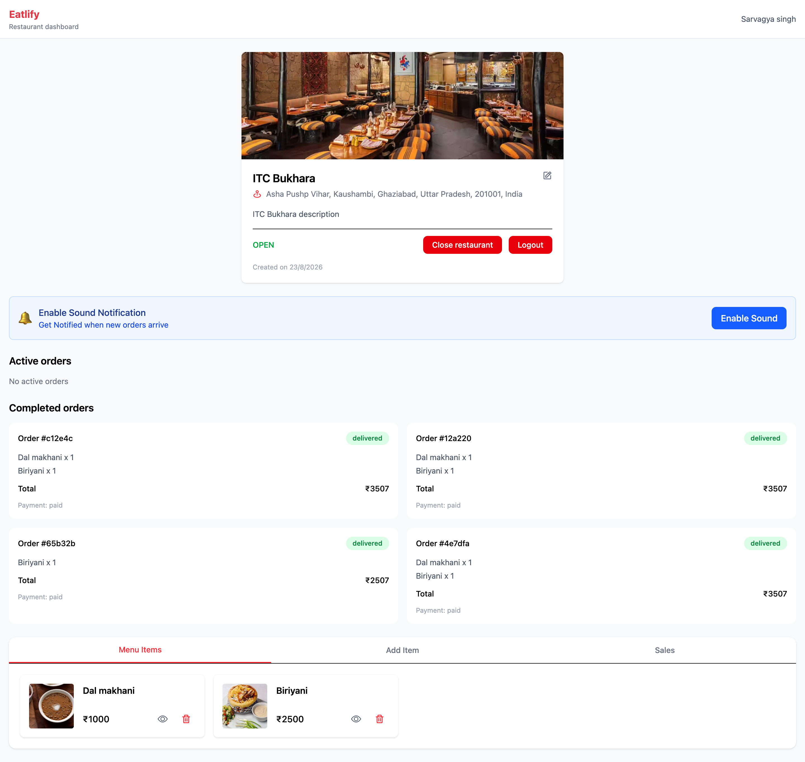 | 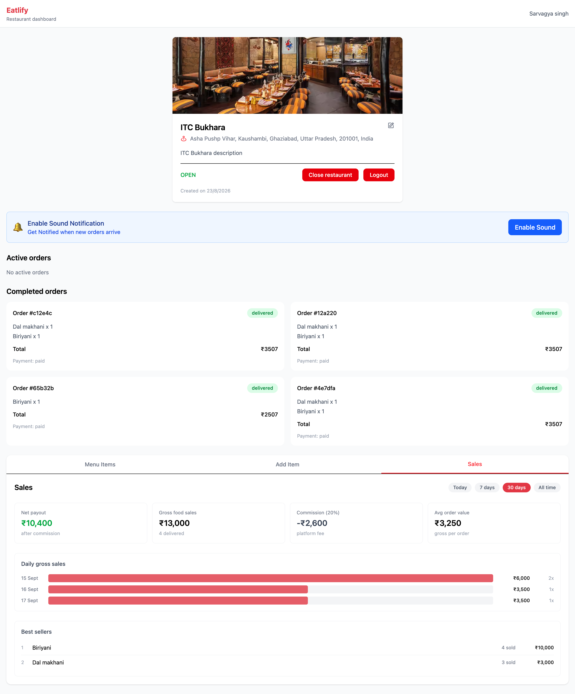 |

### Rider

Live offers and active delivery, completed history, and earnings by range.

| Live | Completed | Earnings |
|---|---|---|
| 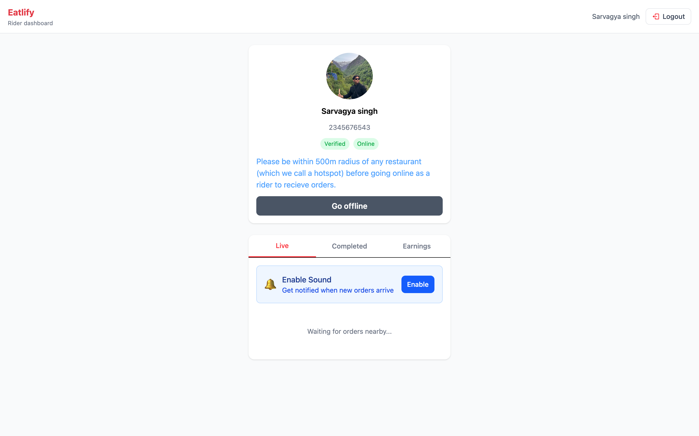 | 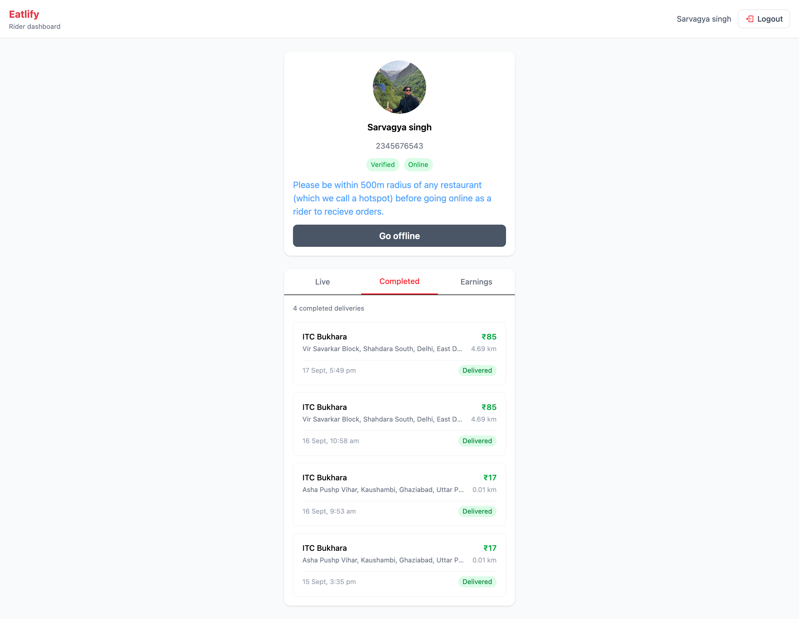 | 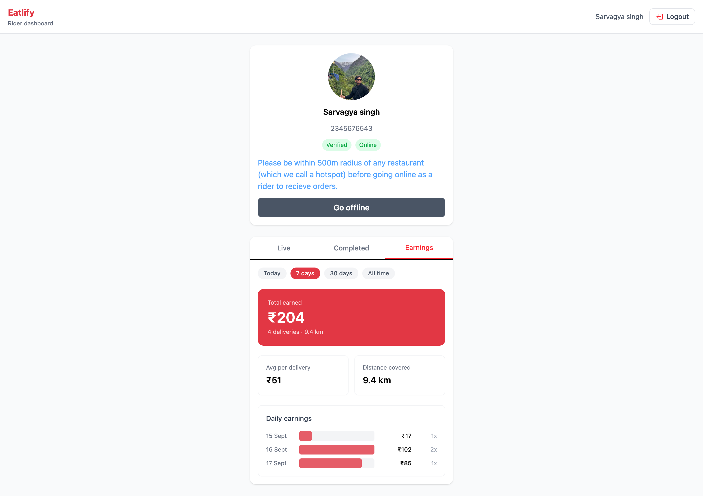 |

### Admin & login

| Approval queue | Login |
|---|---|
| 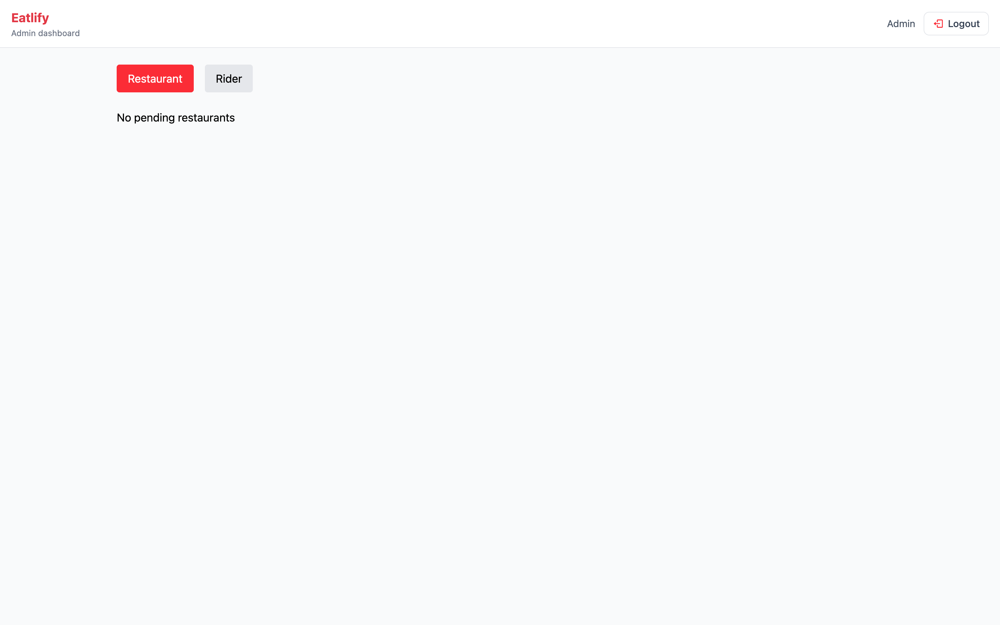 | 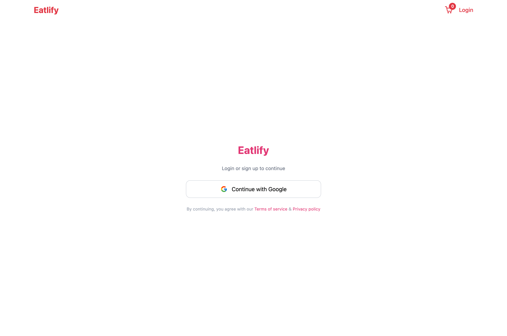 |

## Features

### Customers
- **Google OAuth login** — no passwords; a JWT is issued on first sign-in and a
  role is chosen immediately after
- **Nearby restaurant discovery** using a MongoDB `$geoNear` query against a
  `2dsphere` index, ordered by real distance from the delivery address
- **Address book on an interactive map** — pick a point with Leaflet, reverse
  geocode it to a readable address, save it for reuse
- **Cart scoped to a single restaurant**, with quantity controls and a running
  subtotal, delivery fee and platform fee breakdown
- **Two payment providers** — Razorpay (in-page checkout) and Stripe (hosted
  redirect); payment success is confirmed over RabbitMQ, not the browser
- **Live order tracking** — status changes arrive over Socket.IO, and once a
  rider picks up, their position streams onto a Leaflet map with a road route
  drawn between rider and destination
- **Order history** with per-order item breakdown and status

### Restaurant owners (sellers)
- **Restaurant profile** with image upload, phone, map-pinned location, and an
  open/closed switch that immediately stops new orders
- **Menu management** — add items with images, toggle per-item availability,
  delete items
- **Live order board** — new paid orders arrive over Socket.IO with an audible
  alert, and advance through `accepted -> preparing -> ready_for_rider`
- **Sales dashboard** — gross food sales, platform commission, net payout,
  average order value, best-selling items and a daily bar series, filterable by
  today / 7 days / 30 days / all time. Delivered orders count as earned;
  paid orders still in flight are shown separately as pending

### Riders
- **Onboarding with document capture** — Aadhaar, driving licence and a photo,
  held unverified until an admin approves
- **Go online / offline**, gated on verification, with the rider's current
  position recorded for dispatch
- **Order offers broadcast to nearby available riders** — RabbitMQ fans the
  offer out, a sound plays, and the first rider to accept wins the order
- **Active delivery view** with a live map, road routing and one-tap
  `picked_up -> delivered` progression
- **Delivery history**, paginated, showing what each drop paid
- **Earnings dashboard** — total earned, deliveries completed, distance
  covered, average per delivery and a daily series, over the same date ranges

### Admins
- **Approval queue** for restaurants and riders awaiting verification, each
  showing the submitted documents and details
- **One-click verification** that immediately unblocks the seller or rider

### Platform-wide
- **Six independently deployable services**, each with its own `package.json`,
  `.env` and lifecycle — no shared workspace or shared code package
- **Role-based access** enforced twice: frontend route guards plus backend
  middleware (`isAuth`, `isSeller`, `isAdmin`)
- **Service-to-service calls guarded by a shared internal key** that is never
  shipped to the browser
- **Event-driven where delivery matters** — payment confirmation and rider
  dispatch go through RabbitMQ queues rather than direct HTTP, so a service
  restart does not lose them
- **Unpaid orders self-destruct** via a 15-minute MongoDB TTL index

## Architecture

```
                       front-end (React + Vite, :5173)
                                    │
        ┌──────────────┬────────────┼────────────┬──────────────┐
        ▼              ▼            ▼            ▼              ▼
     auth          restaurant     utils        rider         admin
    :5001            :5002        :5003        :5005         :5006
  OAuth, JWT,     restaurants,   uploads,    delivery     approve
     roles        menu, cart,    payments    lifecycle   restaurants
                  address, ORDERS                         & riders
        │              │            │            │              │
        └──────────────┴─────┬──────┴────────────┴──────────────┘
                             │
                  realtime :5004  ── Socket.IO to the browser
                             │
                  RabbitMQ         MongoDB Atlas (Food_Ordering_db)
```

Every service is a standalone Express + TypeScript app with its own
`package.json` and `.env` — there is no shared workspace tooling or shared code
package. They cooperate three ways:

1. **A shared JWT.** `auth` issues it; every other service verifies it with the
   same `JWT_SECRET`. The token embeds the user object, so **a role change only
   takes effect after the user logs in again.**
2. **`x-internal-key` for service-to-service HTTP.** Guards routes that must
   never be reachable from a browser, such as `realtime`'s emit endpoint and the
   order endpoints the rider service calls.
3. **RabbitMQ for events that must not be lost.** `utils` publishes payment
   success; `restaurant` publishes "order ready for a rider".

> **Orders live in the `restaurant` service**, not a separate order service. It
> owns the `Order` model and the whole order lifecycle.

### Message flow

| Event | Published by | Consumed by | Effect |
|---|---|---|---|
| `PAYMENT_SUCCESS` | utils | restaurant | Marks the order paid, clears its TTL, notifies the restaurant |
| `ORDER_READY_FOR_RIDER` | restaurant | rider | Finds nearby available riders and offers them the order |

### Socket.IO rooms

`realtime` verifies the handshake token and joins each socket to `user:<userId>`,
plus `restaurant:<restaurantId>` for sellers. Other services push through
`POST /api/v1/internal/emit`, which is internal-key guarded.

| Event | Room | Meaning |
|---|---|---|
| `order:new` | `restaurant:<id>` | A paid order arrived |
| `order:update` | `user:<id>`, `restaurant:<id>` | Status changed |
| `order:rider_assigned` | `user:<id>`, `restaurant:<id>` | A rider took the order |
| `order:available` | `user:<riderUserId>` | An order is on offer |
| `rider:status` | `user:<riderUserId>` | Online/offline changed |
| `rider:location` | `user:<customerId>` | Live rider position |

## Order lifecycle

```
placed ─> accepted ─> preparing ─> ready_for_rider ─> rider_assigned ─> picked_up ─> delivered
   │          └──────── seller ────────┘                    └───── rider ─────┘
   └─ cancelled
```

An unpaid order carries a 15-minute `expiresAt` TTL and is removed by MongoDB if
payment never lands. Successful payment `$unset`s that field, so paid orders
persist permanently — which is what makes earnings history reliable.

## Money

| Component | Who pays | Who receives |
|---|---|---|
| `subTotal` | customer | restaurant, less commission |
| `deliveryFee` | customer (₹49 under ₹250, else free) | platform |
| `platformFee` | customer (flat ₹7) | platform |
| `riderAmount` | platform | rider (₹17 × km, rounded up) |

The platform additionally takes a **20% commission** on `subTotal`
(`PLATFORM_COMMISSION_RATE` in `services/restaurant/src/controllers/order.ts`).
A restaurant's net payout is `subTotal − commission`. Delivered orders count as
earned; paid orders still in flight are reported separately as pending.

## Tech Stack

### Frontend
| Library | Used for |
|---|---|
| React 19 + TypeScript | UI, with role-based shells rather than a single route tree |
| Vite 8 | Dev server and production build |
| Tailwind CSS v4 (`@tailwindcss/vite`) | All styling; no component library |
| React Router 6 | Customer-facing routes and route guards |
| Axios | Every HTTP call, with a bearer token from `localStorage` |
| `@react-oauth/google` | Google sign-in via the auth-code popup flow |
| **Leaflet + `react-leaflet`** | All maps: address picking, rider tracking, delivery view |
| **`leaflet-routing-machine`** | Draws the actual road route between rider and drop, via the public OSRM router |
| `socket.io-client` | Live order status and rider position, WebSocket transport only |
| `@stripe/stripe-js` | Present as a dependency; Stripe Checkout is a hosted redirect so it is not loaded at runtime |
| `react-hot-toast` | All user feedback |
| `react-icons` | Icon set |

**External map services, called straight from the browser — no API key, no quota guarantees:**

| Service | Used for |
|---|---|
| OpenStreetMap tiles | Base layer on every map |
| **Nominatim** (`nominatim.openstreetmap.org`) | Reverse geocoding a pin into a readable address, in `AppContext` and `AddAddressPage` |
| **OSRM** (`router.project-osrm.org`) | Road routing between rider and destination, in both map components |

Both are free public endpoints with usage policies and no uptime guarantee. If
maps or addresses misbehave in production, check these before suspecting your
own code.

### Backend
| Library | Used for |
|---|---|
| Node.js 20+ / Express 5 | All six services |
| TypeScript | Compiled per service with `tsc`; no bundler |
| Mongoose 8/9 | Models in `auth`, `restaurant`, `rider`, including **`2dsphere` geospatial indexes** for nearby search and dispatch, and a **TTL index** to expire unpaid orders |
| MongoDB driver (raw) | `admin` only — it reads collections other services own, so it deliberately avoids redefining their schemas |
| `jsonwebtoken` | One shared `JWT_SECRET` across every service |
| **Socket.IO** | The `realtime` service; rooms are `user:<id>` and `restaurant:<id>` |
| **RabbitMQ (`amqplib`)** | Payment confirmation and rider dispatch queues |
| Multer + `datauri` | Multipart upload handling before forwarding to Cloudinary |
| Cloudinary | Image hosting for restaurants, menu items and rider documents |
| **Razorpay** | Primary payment provider, with server-side signature verification |
| **Stripe** | Alternative provider, via hosted Checkout sessions |
| `googleapis` | Exchanges the OAuth auth code for a profile |
| `cors` | Env-driven allow-list per service |

## Project Structure

```
front-end/                    React SPA
├── src/components/           Shared UI, including the seller and rider panels
├── src/pages/                Route-level and role-level screens
├── src/context/              AppContext (session, cart) and SocketContext
└── src/utils/                Formatting and order-flow helpers

services/
├── auth/                     Google OAuth, JWT issuance, role assignment
├── restaurant/               Restaurants, menu, cart, addresses, ORDERS, sales
├── utils/                    Cloudinary uploads, Razorpay + Stripe payments
├── realtime/                 Socket.IO gateway, internal emit endpoint
├── rider/                    Rider profiles, delivery lifecycle, earnings
└── admin/                    Restaurant and rider verification
```

## Roles

| Role | How it is granted | Sees |
|---|---|---|
| `customer` | self-selected after first login | Discovery, cart, checkout, order tracking |
| `seller` | self-selected after first login | Restaurant profile, menu, live orders, sales |
| `rider` | self-selected after first login | Live offers, active delivery, history, earnings |
| `admin` | **set directly in MongoDB** | Pending restaurant and rider approvals |

`admin` is deliberately excluded from the self-service role endpoint, so there is
no way to escalate to it through the API. To create one, set `role: "admin"` on
the user document, then **log out and back in** — the old JWT still carries the
previous role.

Sellers and riders both start unverified and need admin approval: a rider cannot
go online until `isVerified` is true.

## Getting Started

### Prerequisites
- Node.js 20+
- MongoDB (Atlas or local)
- RabbitMQ — the quickest local option:
  `docker run -d --name rabbitmq -p 5672:5672 -p 15672:15672 rabbitmq:3-management-alpine`
- Cloudinary account (image uploads)
- Google OAuth credentials (login)
- Razorpay and/or Stripe test keys (payments)

### Setup

Each service is standalone. From the repo root, for each of the six:

```bash
cd services/<service> && npm install && cp .env.example .env   # then fill it in
npm run dev
```

Ports are `auth:5001`, `restaurant:5002`, `utils:5003`, `realtime:5004`,
`rider:5005`, `admin:5006`.

Then the frontend:

```bash
cd front-end && npm install && npm run dev      # http://localhost:5173
```

The frontend needs **no `.env` for local development** — `src/main.tsx` falls
back to the localhost ports above. Copy `.env.example` only to override the
Google client id, the Stripe publishable key, or to point at a deployed backend.

### Things that will bite you

- **`JWT_SECRET` must be byte-identical across all six services.** A mismatch
  shows up as a 401 from one service while the others work.
- **`INTERNAL_SERVICE_KEY` must match too**, and must never be given a `VITE_`
  prefix — anything `VITE_`-prefixed is compiled into the browser bundle.
- **`DB_NAME` in `admin`** must be `Food_Ordering_db`, matching what the mongoose
  services hardcode. It defaults to that value; setting it to something else
  makes the admin panel silently report no pending approvals.
- **A role or restaurant change needs a fresh login** to reach the JWT.
- **Riders must be within 500m of a restaurant** to receive offers.

## API Overview

### auth — `/api/auth`
| Method | Route | Description |
|---|---|---|
| POST | `/login` | Google OAuth code exchange, returns JWT |
| PUT | `/add/role` | Set role (`customer` / `seller` / `rider`) |
| GET | `/me` | Authenticated user, decoded from the token |

### restaurant — `/api/restaurant`, `/api/item`, `/api/cart`, `/api/address`, `/api/order`
| Method | Route | Description |
|---|---|---|
| POST | `/restaurant/add` | Create restaurant (seller) |
| GET | `/restaurant/my` | The logged-in seller's restaurant |
| PUT | `/restaurant/status` | Toggle open/closed |
| PUT | `/restaurant/edit` | Update details |
| GET | `/restaurant/all` | Nearby restaurants (geo search) |
| GET | `/restaurant/:id` | Single restaurant |
| POST | `/item/add` | Add a menu item (seller) |
| GET | `/item/all/:id` | Menu items for a restaurant |
| DELETE | `/item/:itemId` | Delete a menu item |
| PUT | `/item/status/:itemId` | Toggle item availability |
| POST | `/cart/add` | Add to cart |
| GET | `/cart/all` | Current cart |
| PUT | `/cart/inc`, `/cart/dec` | Change quantity |
| DELETE | `/cart/clear` | Empty the cart |
| POST | `/address/add` | Save a delivery address |
| GET | `/address/all` | Saved addresses |
| DELETE | `/address/:id` | Delete an address |
| POST | `/order/add` | Create an order from the cart |
| GET | `/order/myorder` | Customer's paid orders |
| GET | `/order/:id` | Single order (owner only) |
| GET | `/order/restaurant/:restaurantId` | Orders for a restaurant you own |
| GET | `/order/restaurant/:restaurantId/stats` | Sales summary — `?range=today\|7d\|30d\|all` |
| PUT | `/order/:orderId` | Advance status (seller) |

### rider — `/api/rider`
| Method | Route | Description |
|---|---|---|
| POST | `/add` | Create rider profile (with document image) |
| GET | `/my` | Own rider profile |
| PATCH | `/toggle` | Go online/offline (requires verification) |
| POST | `/accept/:orderId` | Accept an offered order |
| GET | `/order/current` | Active delivery, or `null` |
| PATCH | `/order/update/:orderId` | Advance pickup → delivered |
| POST | `/location` | Share live position with the current customer |
| GET | `/orders/completed` | Delivery history — `?page=&limit=` |
| GET | `/earnings` | Earnings summary — `?range=today\|7d\|30d\|all` |

### admin — `/api/v1/admin`
| Method | Route | Description |
|---|---|---|
| GET | `/restaurant/pending` | Restaurants awaiting verification |
| GET | `/rider/pending` | Riders awaiting verification |
| PATCH | `/verify/restaurant/:id` | Approve a restaurant |
| PATCH | `/verify/rider/:id` | Approve a rider |

### utils — `/api`
| Method | Route | Description |
|---|---|---|
| POST | `/upload` | Upload an image to Cloudinary (internal) |
| POST | `/payment/create` | Create a Razorpay order |
| POST | `/payment/verify` | Verify a Razorpay signature |
| POST | `/payment/stripe/create` | Create a Stripe Checkout session |
| POST | `/payment/stripe/verify` | Verify a Stripe session |

### realtime — `/api/v1/internal`
| Method | Route | Description |
|---|---|---|
| POST | `/emit` | Emit to a room. Internal-key only; never expose publicly |

## Deployment notes

The route prefixes above are unique across all six services, so a single
reverse proxy can host the whole backend on one hostname and one certificate,
path-routing `/api/*` to each service. `src/main.tsx` is built for this: set
`VITE_API_BASE_URL` to that one origin and all six service constants follow it.

Set `CORS_ORIGIN` on every service to the deployed frontend origin, and note
that `/socket.io/` needs WebSocket upgrade headers — the client requests the
`websocket` transport with no polling fallback.

## License
Not decided yet.
